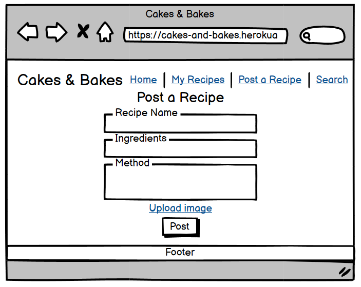

# CAKES AND BAKES

Cakes and Bakes is a recipe blog app created with Django, where users can find recipes for cakes and other sweet treats, and post their own recipes to share with other users.


The app intends to provide a hub for bakers and baking enthusiasts of all ages who want to try out new recipes, gain inspiration, and share their own recipes with others.

The live site can be viewed [here](https://cakes-and-bakes.herokuapp.com/)

## UX

For the site's UX, I chose a bright and colourful scheme using a mix of pastel colours to mirror the fun and creativity that baking involves. I used the Caveat font for the Cakes & Bakes logo, which has a similar style to handwriting to connect with the feeling of a handwritten recipe book. I kept the rest of the font on the site quite simple with Raleway so that the site remains easily accessible and navigable.

### Colour Scheme

I used [coolors.co](https://coolors.co/b48cba-73937e-f1d26a-d4775e-32a287) to generate my colour palette.


I used [Hex Color Tool](https://www.hexcolortool.com) to darken the colors so that accessibility and visibility were adequate on the finished site.

### Typography

- [Caveat](https://fonts.google.com/specimen/Caveat) was used for the Cakes & Bakes logo.

- [Raleway](https://fonts.google.com/specimen/Raleway) was used for headings, primary and secondary text.

- [Font Awesome](https://fontawesome.com) icons were used throughout the site for the social media icons in the footer.

## User Stories

### Site Users

- As a site user, I would like to register for a personal account or login to my existing one, so that I can like and save recipes, and post my own.
- As a site user, I would like to have the option to logout of my account, so that I can protect my web privacy.
- As a site user, I would like to view a paginated listed of recipes, so that I can select which recipe I want to read.
- As a site user, I would like to view images of each recipe, so that I can see what the finished result should look like.
- As a site user, I would like to click on a recipe from the homepage, so that I can I can view a full list of ingredients, method and user reviews.
- As a site user, I would like to post a new recipe, so that I can share my recipes with others.
- As a site user, I would like to edit my recipe once posted, so that I can keep my posts up to date and fix any errors.
- As a site user, I would like to have the option to delete my recipe once posted, so that I can remove them if I no longer want to share them.
- As a site user, I would like to be able to like other recipes, so that I can interact with other users' recipes and save them to my recipe library.
- As a site user, I would like to be able to unlike recipes I have previously liked, so that I can remove them from my recipe library.
- As a site user, I would like to view a paginated list of recipes I have liked, so that I can easily find them later and try them.
- As a site user, I would like to view the total time needed to make each recipe, so that I can know how long it will take me to make.
- As a site user, I would like to view the name of the person who created the recipe, so that I can find more recipes by them.

### Site Admin

- As a site administrator, I should be able to approve or reject new recipe submissions, so that I can filter out objectionable posts.
- As a site administrator, I should be able to approve edits made to recipes by the original poster, so that I can check any changes before sharing on the live site.
- As a site administrator, I should be able to add a new recipe category, so that I can continuously add more options.
- As a site administrator, I should be able to edit recipe categories, so that I can keep categories up to date.
- As a site administrator, I should be able to delete recipe categories, so that I can remove any with spelling mistakes or that are no longer relevant.

## Wireframes

To follow best practice, wireframes were developed for mobile, tablet, and desktop sizes.
I've used [Balsamiq](https://balsamiq.com/wireframes) to design my site wireframes.

### Home Page Wireframes

| Size | Screenshot |
| --- | --- |
| Mobile |  |
| Tablet |  |
| Desktop (Logged In) |  |
| Desktop (Logged Out) |  |

### My Recipes Page Wireframes

| Size | Screenshot |
| --- | --- |
| Mobile |  |
| Tablet |  |
| Desktop |  |

### Post a Recipe Page Wireframes

| Size | Screenshot |
| --- | --- |
| Mobile |  |
| Tablet |  |
| Desktop |  |

## Features

Cakes & Bakes consists of three main pages for users; the Homepage, which shows all posted recipes, the Post a Recipe page where users can post a new recipe, and the Liked Recipes page which shows a list of recipes that user has previously liked. There is also a registration page for new users, account login and logout pages for existing users and the recipe detail page, accessible to all when a recipe title is clicked on from the homepage, which provides the recipe ingredients, method, total time to make and optionally, an image.

Additionally, for site administrators there is a Categories page where they can add a new category or edit/delete an existing one, and an admin panel from which they can approve, edit and delete recipes.

### Existing Features

- **Navbar**

    The navigation bar is found at the top of the page and remains consistent in design across the site. It includes the Cakes & Bakes logo and:
     - a link to the homepage, a link to register and a link to sign in (for logged out/new site users)
     - a link to the homepage, a link to the user's liked recipes, a post a recipe link and a log out link (for registered, logged in site users)
     - a link to the homepage, a link to the user's liked recipes, a link to manage categories, a post a recipe link and a log out link (for logged in administrators/superusers)


- **Register for an account**

    The sign up page is available to new users or logged out users who want to create a new account. A username and password is required but the email address is optional. Once signed up, users will be able to like recipes and post their own.


- **Sign in to your account**

    The sign in page is for returning site users and administrators to log in to their account. It requires the user's username and password.


- **Log out of your account**

    The log in page is available to any logged in user or administrator who would like to sign out of their account.


- **Homepage**

    The homepage is the site's landing page and is available to all users, whether they have access to an account or not. It includes a paginated list of all the recipes posted ordered by date created on with the latest showing first, an image, the author's name and a short recipe description. Users can click on the recipe title to view the recipe details.


- **Recipe Detail page**

    The recipe detail page shows all information posted about the recipe. The heading includes the recipe title, author, image and total time to make. If the user logged in is the author of the recipe, this is also where they will go to edit or delete their recipe post.
    
    
    

    Underneath the recipe heading users can find the ingredients and method for the recipe.

    
    

    At the bottom of the page there is a heart icon which logged in users can click to like a recipe. They are also able to see the total number of likes a recipe has.

    

- **Liked Recipes**

    The liked recipes page carries the layout from the homepage and displays any recipes a user has liked when they are logged into their account.
    
    

- **Posting a Recipe**

    Logged in users can navigate to the post a recipe page where they will be able to use the form to fill out their new recipe. All fields are required apart from the image upload. If a user does not upload an image, a placeholder image will be used instead.
    
    

- **Editing a Recipe**

    Logged in users can edit recipes they have previously posted by clicking onto the recipe from the homepage and then selecting the edit button. This will bring up the post recipe form with the information previously used prepopulating the fields for ease of editing.

    
    

- **Managing Categories**

    Administrators and superusers can navigate to the Categories page in order to add new categories and edit or delete existing ones.

    
    
    

- **Footer**

    The footer is consistent in colour and design across the site and includes the developer's name and social media links. 
    
    

- **Messages and Modals**

    Messages and modals appear throughout the site whenever their is user interactivity. These were implemented to provide users with feedback to let them know if an action they have tried to carry out has been completed successfully or not.
    
    
    
    
    
    
    

    The delete modal allows for an extra step before making permanent changes, such as deletion, to give users and administrators the opportunity to cancel if clicking the button was an accident or they change their mind.

    

- **Django Admin Panel**

    The Django Admin Panel is only accessible to site administrators and superusers. From here you can manage posted recipes, approving new ones or edited ones or deleting any as needed. There's also access to users who have signed up and to managing, editing and deleting recipe categories. 
    
    

### Future Features

- Registration Options
    - Include additional sign-in options for users, such as Facebook or Google, to make it easier to access their account.
- Forgotten Password
    - Include an option for users to reset their password if they have forgotten it so they don't lose their account/liked recipes.
- Featured Recipe
    - Include a featured recipe at the top of the homepage which is set by a site administrator and rotates periodically with a new one.
- Recipe Rating and Comments
    - Include a star rating on individual recipes where users can rate recipes they've tried and leave comments with feedback/suggestions. 
- My Recipes 
    - Include a My Recipes page where users can easily access a list of all the recipes they have posted to the site.

## Tools & Technologies Used

- [HTML](https://en.wikipedia.org/wiki/HTML) used for the main site content.
- [CSS](https://en.wikipedia.org/wiki/CSS) used for the main site design and layout.
- [CSS Flexbox](https://www.w3schools.com/css/css3_flexbox.asp) used for an enhanced responsive layout.
- [Bootstrap](https://getbootstrap.com) used as the front-end CSS framework for modern responsiveness and pre-built components.
- [JavaScript](https://www.javascript.com) used for converting recipe titles to slugs.
- [Python](https://www.python.org) used as the back-end programming language.
- [Git](https://git-scm.com) used for version control. (`git add`, `git commit`, `git push`)
- [GitHub](https://github.com) used for secure online code storage.
- [GitHub Pages](https://pages.github.com) used for hosting the deployed front-end site.
- [Gitpod](https://gitpod.io) used as a cloud-based IDE for development.
- [Markdown Builder by Tim Nelson](https://traveltimn.github.io/markdown-builder) used to help generate the Markdown files.
- [Django](https://www.djangoproject.com) used as the Python framework for the site.
- [PostgreSQL](https://www.postgresql.org) used as the relational database management.
- [ElephantSQL](https://www.elephantsql.com) used as the Postgres database.
- [Heroku](https://www.heroku.com) used for hosting the deployed back-end site.
- [Cloudinary](https://cloudinary.com) used for online static file storage.
- [Hex Color Tool](https://www.hexcolortool.com/#24bcbc) used for darkening background colors for accesibility/readability.
- [Jimpix](https://jimpix.co.uk/words/username-generator.asp) used for generating random usernames for recipe posts

## Database Design

I designed two custom models, the Recipe model which contains all the information required to post a new recipe as well as to approve it as an administrator and like it as a user, and the connected Category model which allows users to include a recipe type when posting their recipes. 

```python
class Recipe(models.Model):
    '''
    Database model for recipe components
    '''
    title = models.CharField(
        max_length=50, unique=True, null=False, blank=False
    )
    slug = models.SlugField(
        max_length=200, unique=True, null=False, blank=False
    )
    author = models.ForeignKey(
        User, on_delete=models.CASCADE, related_name="recipe_post"
    )
    category = models.ForeignKey(
        Category,
        on_delete=models.CASCADE
    )
    total_time = models.CharField(max_length=50, null=False, blank=False)
    ingredients = models.TextField(null=False, blank=False)
    method = models.TextField(null=False, blank=False)
    image = CloudinaryField('image', default='placeholder')
    recipe_description = models.CharField(
        max_length=200, null=False, blank=False
    )
    posted_on = models.DateTimeField(auto_now_add=True)
    likes = models.ManyToManyField(
        User, related_name='recipe_likes', blank=True
    )
    approved = models.BooleanField(default=False)

    class Meta:
        ordering = ['-posted_on']

    def __str__(self):
        return self.title

    def number_of_likes(self):
        return self.likes.count()
```

```python
class Category(models.Model):
    '''
    Database model for recipe categories
    '''
    recipe_type = models.CharField(max_length=50, null=False, blank=False)

    class Meta:
        verbose_name = 'Category'
        verbose_name_plural = 'Categories'

    def __str__(self):
        return self.recipe_type
```

## Agile Development Process

### GitHub Projects

[GitHub Projects](https://github.com/katkapsasky/cakes-and-bakes/projects) served as an Agile tool for this project.
It isn't a specialized tool, but with the right tags and project creation/issue assignments, it can be made to work.

Through it, user stories and issues were planned, then tracked on a weekly basis using the basic Kanban board.


### GitHub Issues

[GitHub Issues](https://github.com/katkapsasky/cakes-and-bakes/issues) served as an another Agile tool.
There, I used my own **User Story Template** to manage user stories.

- [Open Issues](https://github.com/katkapsasky/cakes-and-bakes/issues)

    

- [Closed Issues](https://github.com/katkapsasky/cakes-and-bakes/issues?q=is%3Aissue+is%3Aclosed)

    

### MoSCoW Prioritization

I've decomposed my Epics into stories prior to prioritizing and implementing them.
Using this approach, I was able to apply the MoSCow prioritization and labels to my user stories within the Issues tab.

- **Must Have**: guaranteed to be delivered (*max 60% of stories*)
- **Should Have**: adds significant value, but not vital (*the rest ~20% of stories*)
- **Could Have**: has small impact if left out (*20% of stories*)
- **Won't Have**: not a priority for this iteration

## Testing

For all testing, please refer to the [TESTING.md](TESTING.md) file.

## Deployment

The live deployed application can be found deployed on [Heroku](https://cakes-and-bakes.herokuapp.com).

### ElephantSQL Database

This project uses [ElephantSQL](https://www.elephantsql.com) for the PostgreSQL Database.

To obtain your own Postgres Database, sign-up with your GitHub account, then follow these steps:
- Click **Create New Instance** to start a new database.
- Provide a name (this is commonly the name of the project: cakes-and-bakes).
- Select the **Tiny Turtle (Free)** plan.
- You can leave the **Tags** blank.
- Select the **Region** and **Data Center** closest to you.
- Once created, click on the new database name, where you can view the database URL and Password.

### Cloudinary API

This project uses the [Cloudinary API](https://cloudinary.com) to store media assets online, due to the fact that Heroku doesn't persist this type of data.

To obtain your own Cloudinary API key, create an account and log in.
- For *Primary interest*, you can choose *Programmable Media for image and video API*.
- Optional: *edit your assigned cloud name to something more memorable*.
- On your Cloudinary Dashboard, you can copy your **API Environment Variable**.
- Be sure to remove the `CLOUDINARY_URL=` as part of the API **value**; this is the **key**.

### Heroku Deployment

This project uses [Heroku](https://www.heroku.com), a platform as a service (PaaS) that enables developers to build, run, and operate applications entirely in the cloud.

Deployment steps are as follows, after account setup:

- Select **New** in the top-right corner of your Heroku Dashboard, and select **Create new app** from the dropdown menu.
- Your app name must be unique, and then choose a region closest to you (EU or USA), and finally, select **Create App**.
- From the new app **Settings**, click **Reveal Config Vars**, and set your environment variables.

| Key | Value |
| --- | --- |
| `CLOUDINARY_URL` | insert your own Cloudinary API key here |
| `DATABASE_URL` | insert your own ElephantSQL database URL here |
| `DISABLE_COLLECTSTATIC` | 1 (*this is temporary, and can be removed for the final deployment*) |
| `SECRET_KEY` | this can be any random secret key |

Heroku needs two additional files in order to deploy properly.
- requirements.txt
- Procfile

You can install this project's **requirements** (where applicable) using:
- `pip3 install -r requirements.txt`

If you have your own packages that have been installed, then the requirements file needs updated using:
- `pip3 freeze --local > requirements.txt`

The **Procfile** can be created with the following command:
- `echo web: gunicorn app_name.wsgi > Procfile`
- *replace **app_name** with the name of your primary Django app name; the folder where settings.py is located*

For Heroku deployment, follow these steps to connect your own GitHub repository to the newly created app:

Either:
- Select **Automatic Deployment** from the Heroku app.

Or:
- In the Terminal/CLI, connect to Heroku using this command: `heroku login -i`
- Set the remote for Heroku: `heroku git:remote -a cakes-and-bakes`
- After performing the standard Git `add`, `commit`, and `push` to GitHub, you can now type:
	- `git push heroku main`

The project should now be connected and deployed to Heroku!

### Local Deployment

This project can be cloned or forked in order to make a local copy on your own system.

For either method, you will need to install any applicable packages found within the *requirements.txt* file.
- `pip3 install -r requirements.txt`.

You will need to create a new file called `env.py` at the root-level,
and include the same environment variables listed above from the Heroku deployment steps.

Sample `env.py` file:

```python
import os

os.environ.setdefault("CLOUDINARY_URL", "insert your own Cloudinary API key here")
os.environ.setdefault("DATABASE_URL", "insert your own ElephantSQL database URL here")
os.environ.setdefault("SECRET_KEY", "this can be any random secret key")

# local environment only (do not include these in production/deployment!)
os.environ.setdefault("DEBUG", "True")
```

Once the project is cloned or forked, in order to run it locally, you'll need to follow these steps:
- Start the Django app: `python3 manage.py runserver`
- Stop the app once it's loaded: `CTRL+C` or `⌘+C` (Mac)
- Make any necessary migrations: `python3 manage.py makemigrations`
- Migrate the data to the database: `python3 manage.py migrate`
- Create a superuser: `python3 manage.py createsuperuser`
- Load fixtures (if applicable): `python3 manage.py loaddata file-name.json` (repeat for each file)
- Everything should be ready now, so run the Django app again: `python3 manage.py runserver`

#### Cloning

You can clone the repository by following these steps:

1. Go to the [GitHub repository](https://github.com/katkapsasky/cakes-and-bakes) 
2. Locate the Code button above the list of files and click it 
3. Select if you prefer to clone using HTTPS, SSH, or GitHub CLI and click the copy button to copy the URL to your clipboard
4. Open Git Bash or Terminal
5. Change the current working directory to the one where you want the cloned directory
6. In your IDE Terminal, type the following command to clone my repository:
	- `git clone https://github.com/katkapsasky/cakes-and-bakes.git`
7. Press Enter to create your local clone.

Alternatively, if using Gitpod, you can click below to create your own workspace using this repository.

[](https://gitpod.io/#https://github.com/katkapsasky/cakes-and-bakes)

Please note that in order to directly open the project in Gitpod, you need to have the browser extension installed.
A tutorial on how to do that can be found [here](https://www.gitpod.io/docs/configure/user-settings/browser-extension).

#### Forking

By forking the GitHub Repository, we make a copy of the original repository on our GitHub account to view and/or make changes without affecting the original owner's repository.
You can fork this repository by using the following steps:

1. Log in to GitHub and locate the [GitHub Repository](https://github.com/katkapsasky/cakes-and-bakes)
2. At the top of the Repository (not top of page) just above the "Settings" Button on the menu, locate the "Fork" Button.
3. Once clicked, you should now have a copy of the original repository in your own GitHub account!

## Credits

### Content

| Source | Location | Notes |
| --- | --- | --- |
| [I Think Therefore I Blog by Code Institute](https://codeinstitute.net/) | whole site | used as a template to build upon for main site functionality |
| [Django 101 Open Tech School](http://opentechschool.github.io/django-101/en/first_steps/views_templates.html) | views.py | Creating the first Django views |
| [Py Tutorial by Alexander Williams](https://pytutorial.com/how-to-solve-you-are-trying-to-add-a-non-nullable-field-to-without-a-default/?utm_content=cmp-true) | models.py | fixing non-nullable field error |
| [Organize Django Models, Stack Overflow](https://stackoverflow.com/questions/61618882/best-way-to-organize-models-for-django-recipe-app-with-ingredients-recipes-and) | models.py | organizing recipe model |
| [Markdown Builder by Tim Nelson](https://traveltimn.github.io/markdown-builder) | README and TESTING | tool to help generate the Markdown files |
| [Bootstrap Modal](https://getbootstrap.com/docs/5.0/components/modal/) | Delete Recipe/Category buttons | used as an extra step of user feedback when attempting permanent actions |

### Media

| Source | Used for | Type | 
| --- | --- | --- | 
| [BBC Good Food, Angela Nilsen](https://www.bbcgoodfood.com/recipes/ultimate-apple-pie) | apple pie recipe | recipe title, description, total time, ingredients and method | 
| [BBC Good Food, Valerie Barrett](https://www.bbcgoodfood.com/recipes/vintage-chocolate-chip-cookies) | chocolate chip cookies recipe | recipe title, description, total time, ingredients and method | 
| [BBC Good Food, Mary Cadogan](https://www.bbcgoodfood.com/recipes/no-cook-chocolate-tart) | chocolate chip cookies recipe | recipe title, description, total time, ingredients and method | 
| [BBC Good Food, Tana Ramsay](https://www.bbcgoodfood.com/recipes/lemon-drizzle-cake) | lemon drizzle cake recipe | recipe title, description, total time, ingredients and method | 
| [BBC Good Food, Good Food Team](https://www.bbcgoodfood.com/recipes/strawberry-cheesecake-4-easy-steps) | strawberry cheesecake recipe | recipe title, description, total time, ingredients and method |
| [BBC Good Food, Orlando Murrin](https://www.bbcgoodfood.com/recipes/best-ever-chocolate-brownies-recipe) | chocolate brownies recipe | recipe title, description, total time, ingredients and method |
| [Unsplash, Callum Hill](https://unsplash.com/photos/LdK3Q7AAGPc) | placeholder image recipe posts | image | 
| [Pexels, Asya Vlasova](https://www.pexels.com/photo/apple-pie-and-raspberry-pie-3065590/) | apple pie recipe | image |
| [Pexels, Regina Ferraz](https://www.pexels.com/search/chocolate%20tart/) | chocolate tart recipe | image |
| [Pexels, Lisa Fotios](https://www.pexels.com/photo/macro-photography-of-pile-of-3-cookie-230325/) | chocolate chip cookies recipe | image |
| [Pexels, Arun Thomas](https://www.pexels.com/photo/close-up-photograph-of-a-lemon-cake-8211178/) | lemon drizzle cake recipe | image |
| [Pexels, Suzy Hazelwood](https://www.pexels.com/photo/cheesecake-1126359/) | strawberry cheesecake recipe | image |
| [Pexels, Nikola Cedikova](https://www.pexels.com/photo/brown-bread-on-white-ceramic-plate-4555505/) | chocolate brownies recipe | image |
| [TinyPNG](https://tinypng.com) | compressing size of placeholder image | image |

### Acknowledgements

- I would like to thank my Code Institute mentor, [Tim Nelson](https://github.com/TravelTimN) for their support throughout the development of this project.
- I would like to thank the [Code Institute](https://codeinstitute.net) tutor team for their assistance with troubleshooting and debugging some project issues.
- I would like to thank the [Code Institute Slack community](https://code-institute-room.slack.com) for the moral support; it kept me going during periods of self doubt and imposter syndrome.
