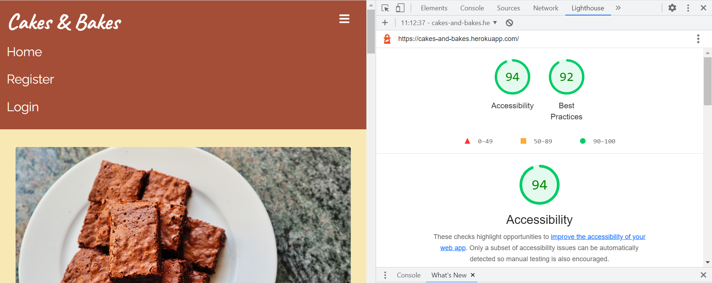
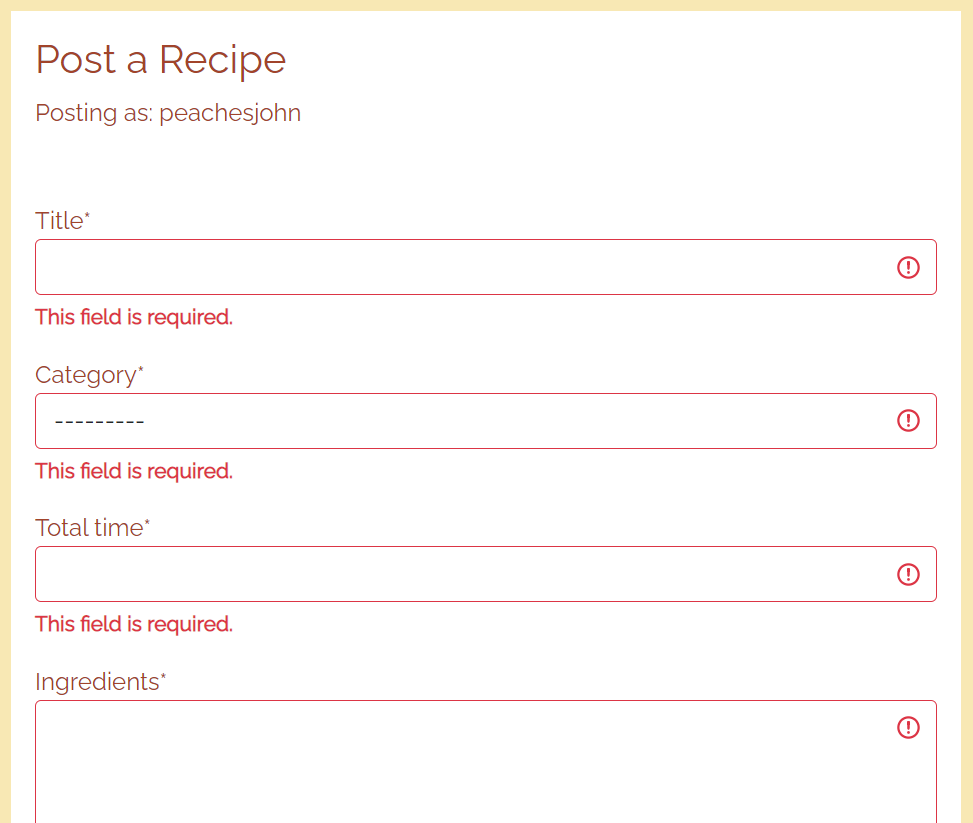
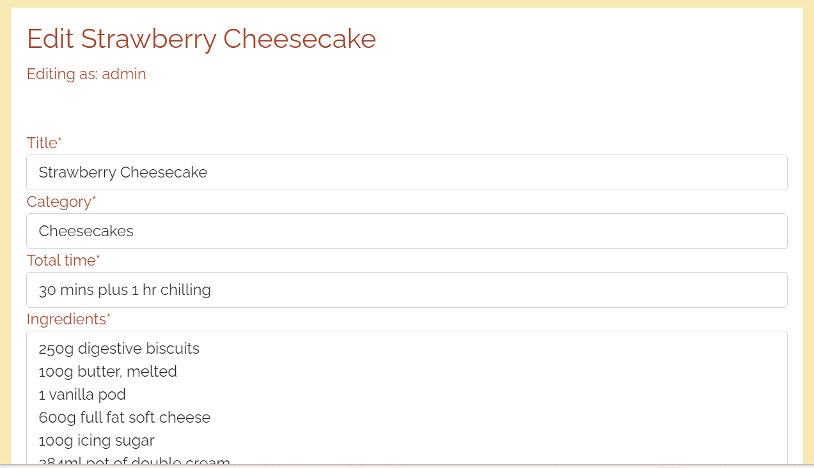
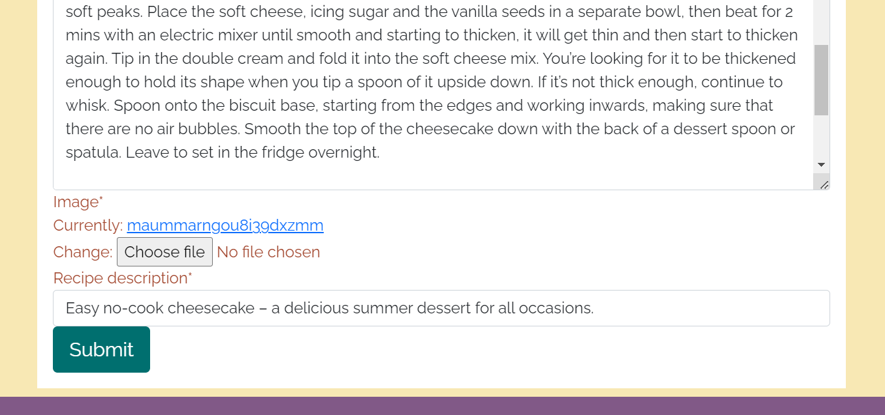
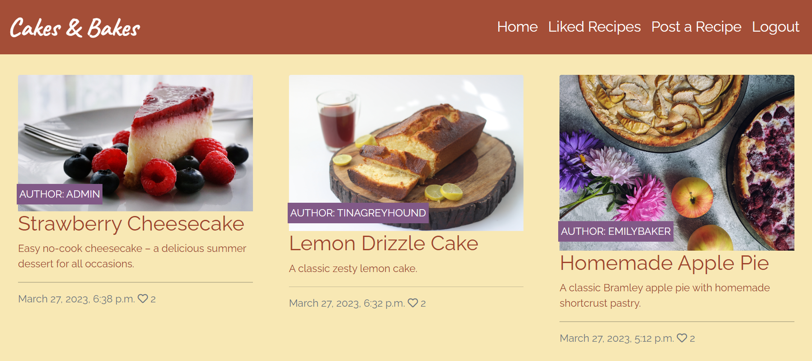
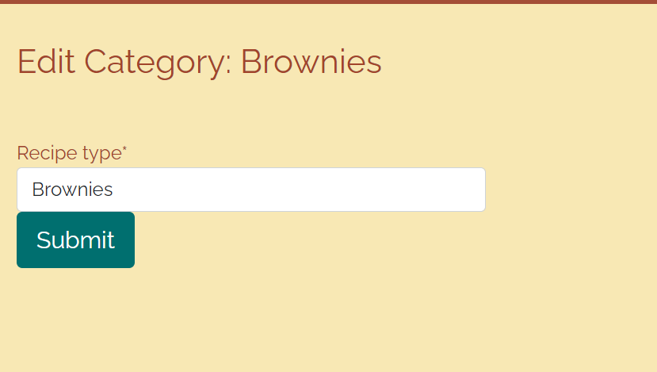
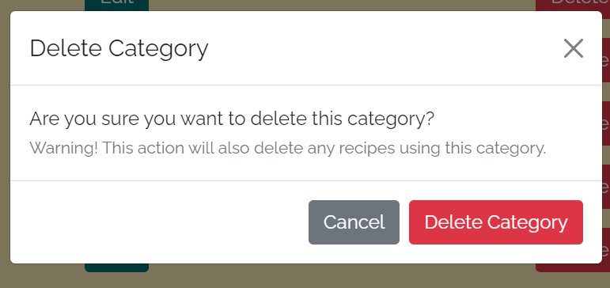

# Testing

Return back to the [README.md](README.md) file.

## Code Validation

### HTML

I have used the recommended [HTML W3C Validator](https://validator.w3.org) to validate all of my HTML files.

| Page | W3C URL | Screenshot | Notes |
| --- | --- | --- | --- |
| Home | [W3C](https://validator.w3.org/nu/?doc=https%3A%2F%2Fcakes-and-bakes.herokuapp.com%2F) |  | Pass: No Errors |
| Recipe Detail | [W3C](https://validator.w3.org/nu/?doc=https%3A%2F%2Fcakes-and-bakes.herokuapp.com%2Fchocolate-brownies%2F) |  | Pass: No Errors |
| Sign In | [W3C](https://validator.w3.org/nu/?doc=https%3A%2F%2Fcakes-and-bakes.herokuapp.com%2Faccounts%2Flogin%2F) |  | Pass: No Errors |
| Sign Up | [W3C](https://cakes-and-bakes.herokuapp.com/accounts/signup/) |  | Pass: No Errors |
| Sign Out | n/a |  | Pass: No Errors |
| Liked Recipes | n/a |  | Pass: No Errors |
| Post a Recipe | n/a |  | Pass: No Errors |
| Edit a Recipe | n/a |  | Pass: No Errors |
| Manage Categories | n/a |  | Pass: No Errors |
| Add a Category | n/a |  | Pass: No Errors |
| Edit a Category | n/a |  | Pass: No Errors |

### CSS

I have used the recommended [CSS Jigsaw Validator](https://jigsaw.w3.org/css-validator) to validate all of my CSS files.

| File | Jigsaw URL | Screenshot | Notes |
| --- | --- | --- | --- |
| style.css | [Jigsaw](https://jigsaw.w3.org/css-validator/validator?uri=https%3A%2F%2Fcakes-and-bakes.herokuapp.com%2F&profile=css3svg&usermedium=all&warning=1&vextwarning=&lang=en) |  | Pass: No Errors |

### Python

I have used the recommended [CI Python Linter](https://pep8ci.herokuapp.com) to validate all of my Python files.

| File | CI URL | Screenshot | Notes |
| --- | --- | --- | --- |
| admin.py | [CI PEP8](https://pep8ci.herokuapp.com/https://raw.githubusercontent.com/katkapsasky/cakes-and-bakes/main/recipe/admin.py) |  | Pass: No Errors |
| apps.py | [CI PEP8](https://pep8ci.herokuapp.com/https://raw.githubusercontent.com/katkapsasky/cakes-and-bakes/main/recipe/apps.py) |  | Pass: No Errors |
| cakesandbakes urls.py | [CI PEP8](https://pep8ci.herokuapp.com/https://raw.githubusercontent.com/katkapsasky/cakes-and-bakes/main/cakesandbakes/urls.py) |  | Pass: No Errors |
| recipe urls.py | [CI PEP8](https://pep8ci.herokuapp.com/https://raw.githubusercontent.com/katkapsasky/cakes-and-bakes/main/recipe/urls.py) |  | Pass: No Errors |
| forms.py | [CI PEP8](https://pep8ci.herokuapp.com/https://raw.githubusercontent.com/katkapsasky/cakes-and-bakes/main/recipe/forms.py) |  | Pass: No Errors |
| models.py | [CI PEP8](https://pep8ci.herokuapp.com/https://raw.githubusercontent.com/katkapsasky/cakes-and-bakes/main/recipe/models.py) |  | Pass: No Errors |
| settings.py | [CI PEP8](https://pep8ci.herokuapp.com/https://raw.githubusercontent.com/katkapsasky/cakes-and-bakes/main/cakesandbakes/settings.py) |  | Pass: No Errors |
| tests.py | [CI PEP8](https://pep8ci.herokuapp.com/https://raw.githubusercontent.com/katkapsasky/cakes-and-bakes/main/recipe/tests.py) |  | Pass: No Errors |
| views.py | [CI PEP8](https://pep8ci.herokuapp.com/https://raw.githubusercontent.com/katkapsasky/cakes-and-bakes/main/recipe/views.py) |  | Pass: No Errors |

## Browser Compatibility

I've tested my deployed project on multiple browsers to check for compatibility issues.

| Browser | Screenshot | Notes |
| --- | --- | --- |
| Chrome |  | Works as expected |
| Safari |  | Works as expected |
| Edge |  | Works as expected |

## Responsiveness

I've tested my deployed project on multiple devices to check for responsiveness issues.

| Device | Screenshot | Notes |
| --- | --- | --- |
| Mobile (DevTools) |  | Works as expected |
| Tablet (DevTools) |  | Works as expected |
| Desktop |  | Works as expected |

## Lighthouse Audit

I've tested my deployed project using the Lighthouse Audit tool to check for accessibility issues. The overall score is 94 with a couple of minor warnings.



## Defensive Programming

Forms:
- Users cannot submit an empty form
- Users must fill in all required form fields

Django:
- Users cannot brute-force a URL to navigate to a restricted page
- Users cannot perform CRUD functionality while logged-out
- User-A should not be able to manipulate data belonging to User-B, or vice versa
- Non-Authenticated users should not be able to access pages that require authentication
- Standard users should not be able to access pages intended for superusers

Defensive programming was manually tested with the below user acceptance testing:

| Page | User Action | Expected Result | Pass/Fail | 
| --- | --- | --- | --- | --- |
| Home Page | | | | |
| | Click on Logo | Redirection to Home page | Pass | |
| | Click on Home link in navbar | Redirection to Home page | Pass | |
| Register Page | | | | |
| | Click on Register link in navbar | Redirection to Register page | Pass | |
| | Enter valid password (twice) | Field will only accept password format | Pass | |
| | Click on Sign Up button | Log in and redirect to homepage | Pass | |
| Log In | | | | |
| | Click on Login button | Redirection to Login page | Pass | |
| | Enter valid password | Field will only accept password format | Pass | |
| | Click Login button | Redirects user to home page | Pass | |
| Log Out | | | | |
| | Click Logout button | Redirects user to logout page, confirms log out first | Pass | |
| | Click Confirm Logout button | Redirects user to home page and logs out | Pass | |
| Liked Recipes | | | | |
| | Click on Liked Recipes link in navbar | User will be redirected to the Liked Recipes page | Pass | |
| | View Liked Recipes | Paginated list of recipes user has liked (if any have been liked otherwise empty page) | Pass | |
| Recipe Detail | | | | |
| | Click on Recipe Title from Homepage | User will be redirected to the recipe detail page | Pass | |
| | View Recipe Detail | User can view the recipe title, image, author, total time, ingredients, method | Pass | |
| Post a Recipe | | | | |
| | Click on Post Recipe link in navbar | User will be redirected to Post Recipe page | Pass | |
| | Submit new recipe form | User fills in form and submits, awaits approval in admin panel | Pass | |
| Approve a Recipe | | | | |
| | Navigate to admin panel with /admin and approve new and edited recipes | Approved recipes appear on homepage | Pass | |
| Edit a Recipe | | | | |
| | If logged in as author click edit recipe on recipe detail page | Redirect to edit recipe form page with prepopulated fields | Pass | |
| | Submit edited recipe form | Recipe form becomes unapproved and awaits approval in admin panel | Pass | |
| Delete a Recipe | | | | |
| | If logged in as author click delete recipe on recipe detail page  | Confirm deletion with modal and remove rcipe if confirmed | Pass | |
| Manage Categories (Admin) | | | | |
| | Click on Categories link in navbar | User will be redirected to the Categories page | Pass | |
| | View Existing Categories | Paginated list of existing categories | Pass | |
| | Click on Add Category | Redirected to add category form | Pass | |
| | Submit New Category | Redirect to categories page, new category visible | Pass | |
| | Delete Category | Modal confirms deletion then category is deleted once confirm is clicked | Pass | |


## User Story Testing

| User Story | Screenshot | Additional Screenshot |
| --- | --- | --- | --- |
| As a site user, I would like to register for a personal account or login to my existing one, so that I can like and save recipes, and post my own. |  |
| As a site user, I would like to have the option to logout of my account, so that I can protect my web privacy. |  |
| As a site user, I would like to view a paginated listed of recipes, so that I can select which recipe I want to read. |  |
| As a site user, I would like to view images of each recipe, so that I can see what the finished result should look like. |  |
| As a site user, I would like to click on a recipe from the homepage, so that I can I can view a full list of ingredients and method. |  |  |
| As a site user, I would like to post a new recipe, so that I can share my recipes with others. |  |
| As a site user, I would like to edit my recipe once posted, so that I can keep my posts up to date and fix any errors. |  |  |
| As a site user, I would like to be able to like other recipes, so that I can interact with other users' recipes and save them to my recipe library. |  |
| As a site user, I would like to view a paginated list of recipes I have liked, so that I can easily find them later and try them. |  |
| As a site user, I would like to view the total time needed to make each recipe, so that I can know how long it will take me to make. |  |
| As a site administrator, I should be able to approve or reject new recipe submissions, so that I can filter out objectionable posts. |  |
| As a site administrator, I should be able to add a new recipe category, so that I can continuously add more options. |  |
| As a site administrator, I should be able to edit recipe categories, so that I can keep categories up to date. |  |
| As a site administrator, I should be able to delete recipe categories, so that I can remove any with spelling mistakes or that are no longer relevant. |  |

## Bugs

**Fixed Bugs**

- Missing Alt Attributes
  When running my HTML Templates through the HTML Validator I received an Error for missing img alt attributes. I fixed this by adding alt attributes to the placeholder image and the recipe image uploaded by users when posting a new recipe. 

- Like Functionality not working
  When clicking the heart on a recipe as a logged in user, the like would not show up. I realised that in my RecipeLikes View in views.py I had named my function "recipe" instead of "post" which meant the action wasn't being understood as a post method. 

    ```python
    class RecipeLikes(View):
        """
            Class based function to like a recipe
    """
        def post(self, request, slug, *args, **kwargs):
            recipe = get_object_or_404(Recipe, slug=slug)
            if recipe.likes.filter(id=request.user.id).exists():
                recipe.likes.remove(request.user)
                messages.success(
                    request,
                    'Recipe successfully unliked.'
                )
            else:
                recipe.likes.add(request.user)
                messages.success(
                    request,
                    'Recipe successfully liked.'
                )
            return HttpResponseRedirect(reverse('recipe_detail', args=[slug]))
```

**Unfixed Bugs**

There are no remaining bugs that I am aware of.
